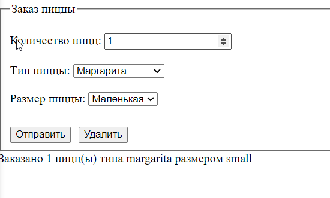
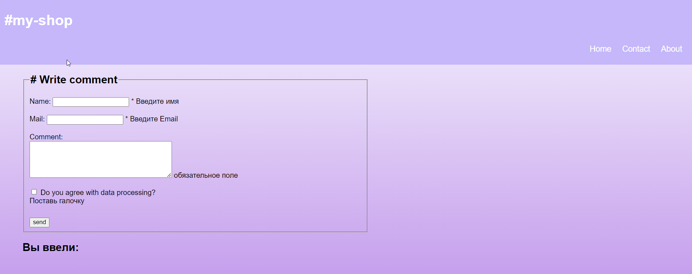
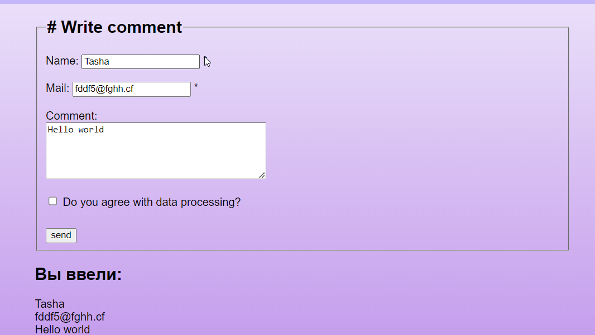
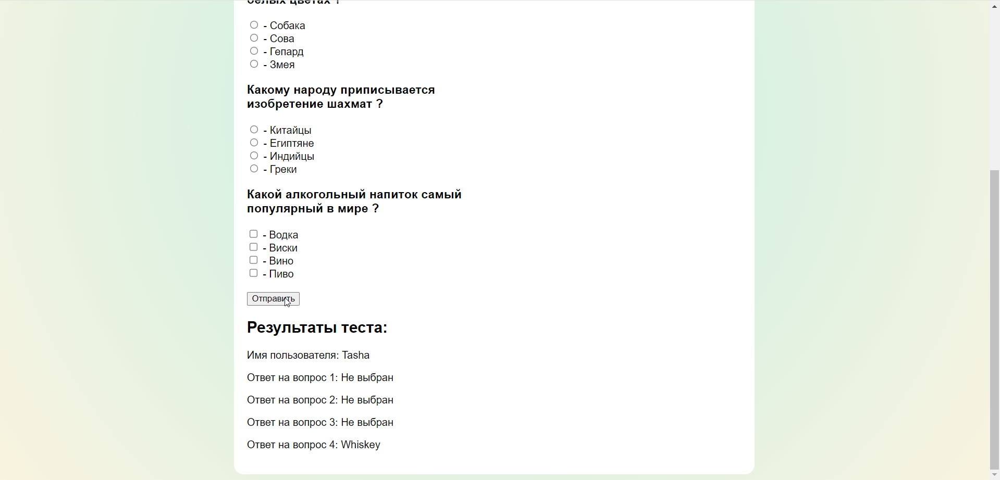

# ЛАБОРАТОРНАЯ РАБОТА №4 Обработка форм в PHP
## 1. Работа с глобальной переменной $_POST
1.1. Интерпретируйте и проанализируйте следующий код
```php
<div class="form">
 <form action=" <?php echo $_SERVER["PHP_SELF"] " method="POST"> ?>
 <fieldset>
 <legend>Оставьте отзыв!</legend>
 <div id="main_info" style="display: flex; flex-direction:column; gap: 10px;">
 <div>
 <label for="name">Имя:
 <input type="text" name="name"/>
 </label>
 </div>
 <div>
 <label for="email">Email:
 <input type="email" name="email"/>
 </label>
 </div>
 </div>
 <div id="extra_info">
 <div>
 <p><label for="review">Оцените наш сервис!</label></p>
 <div style="display: flex; flex-direction: column;">
 <p><input id="review" type="radio" name="review"
value="10" checked>Хорошо</p>
 <p><input id="review" type="radio" name="review"
value="8">Удовлетворительно</p>
 <p><input id="review" type="radio" name="review"
value="5">Плохо</p>
 </div>
 </div>
 </div>
 <div id="message_info">
 <div>
 <p><label for="comment">Ваш комментарий: </label></p>
 <textarea id="comment" name="comment" cols="30"
rows="10" class="comment"></textarea>
 </div>
 </div>
 <div id="buttons" style="display: flex; flex-direction: row;
gap: 10px; margin-top: 10px;">
 <input type="submit" value="Отправить"/>
 <input type="reset" value="Удалить"/>
 </div>
 </fieldset>
 </form>
 <!-- Добавьте в эту область код, который будет отображать сообщение
только после отправки формы -->

 <div id="result">
 <p>Ваше имя: <b><?php echo $_POST["name"] ?></b></p>
 <p>Ваш e-mail: <b><?php echo $_POST["email"] ?></b></p>
 <p>Оценка товара: <b><?php echo $_POST["review"] ?></b></p>
 <p>Ваше сообщение: <b><?php echo $_POST["comment"] ?></b></p>
 </div>
</div>
<?php

```

* Создается форма, в которой используется метод `method="POST"` для отправки данных на сервер и глобальную переменную `$_SERVER["PHP_SELF"]`, для отправки формы на тот же скрипт PHP, который обрабатывает форму. 
* Элемент `<fieldset>` используется для группировки связанных элементов формы внутри рамки. 
* `<legend>` - заголовок формы.
* метки `<label>` используются для связывания текстовых полей с их описанием.
```php
<label for="review">Оцените наш сервис!</label>
<input id="review" type="radio" name="review" value="10" checked>Хорошо
```
* Используются радио-кнопки для оценки сервиса.
* `<textarea>` - текстовая область для ввода комментария.
```php
<input type="submit" value="Отправить" />
<input type="reset" value="Удалить" />
```
* Кнопки для отправки формы и сброса данных.
* Вектор `$ _POST` используется для сбора данных формы, после того как HTML-форма была отправлена на сервер, при помощи метода `post`

1.2. Добавьте в отмеченную область код, который будет отображать сообщение только после отправки формы.

1.3. Добавьте под формой функцию для проверки данных, гарантирующую заполнение всех полей и корректность введенного e-mail.

1.4. Объясните, что такое глобальная переменная $_POST и $_SERVER[“PHP_SELF”]

$_SERVER[“PHP_SELF”] - Возвращает имя файла, в котором выполняется текущий скрипт

Вектор $ _POST используется для сбора данных формы, после того как HTML-форма была отправлена на сервер, при помощи метода „post”

## 2. Получение данных с различных контроллеров
2.1. Создайте форму, состоящую минимум из 3 контроллеров (input, select)
2.1.1. Минимум 1 input с типом number
2.1.2. Минимум 1 select
2.2. Тема формы определяется на ваш выбор
2.3. Обработайте данные и выведите их на экран

```php
<!DOCTYPE html>
<html lang="en">

<head>
    <meta charset="UTF-8">
    <meta name="viewport" content="width=device-width, initial-scale=1.0">
    <title>forma</title>
</head>

<body>

    <form action="<?php echo $_SERVER["PHP_SELF"] ?>method="POST">
        <fieldset>
            <legend>
                Заказ пиццы
            </legend>
            <br>
            <label for="amounght">Количество пицц:</label>
            <input type="number" id="amounght" name="amounght" min="1" value="1" required>
            <br><br>
            <label for="type"> Tип пиццы: </label>
            <select id="type" name="type" required>
                <option value="margarita">Маргарита</option>
                <option value="pepperoni">Пепперони</option>
                <option value="vegetarian">Вегетарианская</option>
            </select>
            <br> <br>
            <label for="pizzaSize">Размер пиццы:</label>
            <select id="pizzaSize" name="pizzaSize" required>
                <option value="small">Маленькая</option>
                <option value="medium">Средняя</option>
                <option value="large">Большая</option>
            </select>
            <br><br>
            <div id="buttons" style="display: flex; flex-direction: row;
gap: 10px; margin-top: 10px;">
                <input type="submit" value="Отправить" />
                <input type="reset" value="Удалить" />
            </div>

        </fieldset>
    </form>

    <?php
    if ($_SERVER["REQUEST_METHOD"] == "POST") {
        $amounght = $_POST["amounght"];
        $type = $_POST["type"];
        $pizzaSize = $_POST["pizzaSize"];

        $outputString = "Заказано  $amounght пицц(ы) типа  $type  размером $pizzaSize";

        echo $outputString;
    }

    ?>
</body>

</html>
```



## 3. Создание, обработка и валидация форм
3.1. Создайте форму, показанную на рисунке (Рисунок 1)

3.2. Создайте собственную функцию валидации, которая будет проверять все поля формы при получении запроса

3.2.1. Для поля “name”: установите минимальную длину в 3 символа,
максимальную - 20 символов, и запретите использование цифр.
```php
 if ($_SERVER["REQUEST_METHOD"] == "POST") {
        if (empty($_POST["name"])) {
            $nameErr = "Введите имя";
        } else {
            $name = test_input($_POST["name"]);
            // проверяем, содержит ли имя только буквы и пробелы
            if (!preg_match("/^(([a-zA-Z' -]{3,20})|([а-яА-ЯЁёІіЇїҐґЄє' -]{3,20}))$/u", $name)) {
                $nameErr = "Имя должно содержать только буквы и пробелы";
            }
        }
    }
```
3.2.2. Для поля “mail”: удостоверьтесь, что адрес электронной почты
соответствует стандартам.
```php
   if (empty($_POST["email"])) {
        $emailErr = "Введите Email";
    } else {
        $email = test_input($_POST["email"]);
        // проверьте, правильно ли сформирован адрес электронной почты
        if (!filter_var($email, FILTER_VALIDATE_EMAIL)) {
            $emailErr = "Неверный формат электронной почты";
        }
    }
```
3.2.3. Для поля “comment”: удостоверьтесь, что оно не пустое и укажите какиелибо другие необходимые критерии валидации (на ваш выбор).
```php
    if (empty($_POST["comment"])) {
        $commentErr = "обязательное поле";
    } else {
        $comment = test_input($_POST["comment"]);
    }
```
* есть проверка на специальные символы всех полей 
```php
function test_input($data)
    {
        $data = trim($data);
        $data = stripslashes($data);
        $data = htmlspecialchars($data);
        return $data;
    }
```
3.2.4. Убедитесь, что пользователь отметил галочку “Do you agree with data processing?” перед отправкой формы" Рисунок 1. Форма комментариев
```php
  if (empty($_POST["agree"])) {
        $agreeErr = "<br> Поставь галочку";
    } else {
        $agree = test_input($_POST["agree"]);
    }
```
3.4. Если пользователь верно ввел данные, выведите комментарий ниже формы (не требуется сохранение комментариев где-либо)


3.5. Чем отличается глобальная переменная $_REQUEST и $_POST?

* $_REQUEST в PHP представляет собой объединенный массив, содержащий данные запроса от клиента. Этот массив может включать данные из переменных $_GET, $_POST, и $_COOKIE.

$_POST - это специальный массив, который содержит данные, отправленные методом POST из HTML-формы. Pазличие заключается в том, что $_POST содержит только данные, отправленные методом POST, в то время как $_REQUEST включает данные из всех методов запроса.

3.6. Дополнительно (Данное задание не является оцениваемым, а помогает вам более подробно погрузиться в изучение PHP)

## 4. Создание формы
4.1. Создайте тест из 3-х вопросов используя input, type radio, и input, type checkbox и запросите имя пользователя. Проверьте заполнение формы и варианты, выбранные пользователем. Выведите результаты на экран.

